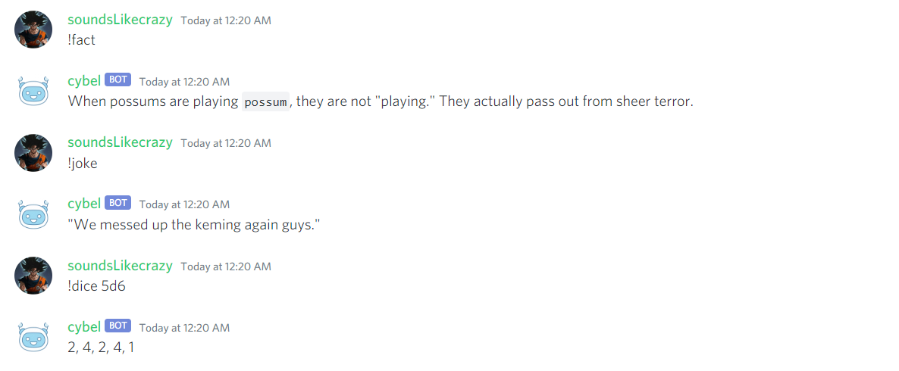

  

  <h2 align="center">👉 Discord Bot implemented in Python 👈</h2>

- [Features](#features)
- [Bot Commands](#bot-commands)
  - [Stable Version Commands](#stable-version-commands)
    - [**Admin Commands**](#admin-commands)
    - [**User Commands**](#user-commands)
  - [Beta Version Commands](#beta-version-commands)
- [Upcoming Feature](#upcoming-feature)
- [Support Here](#support-here)
- [License](#license)
- [Author](#author)
- [Suggestion/Feedbacks](#suggestionfeedbacks)

## Features

- Admin Commands for server management with powerful moderation
- Stay connected every time with 99% uptime
- Custom welcome message for each user when joining
- Separate DM message upon joining the server
- Utility async APIs
- Commands for user access
- Log Everything with embed message
- AutoMod - Delete offensive word automatically
- Use the bot to its full potential without ever annoying anyone
- Modern Pythonic API using async/await syntax
- Easy to use with an object-oriented design
- Optimized for both speed and memory
- Published and approved on Top.gg website. check [here]
(https://top.gg/bot/832137823309004800/invite)
- AI-enabled chatbot(only in Beta Version) # deprecated/removed
- More Features coming soon...

Invite **Cybel** into your server

- [Cybel Stable](https://top.gg/bot/832137823309004800/invite)
- [Cybel Beta](https://discord.com/api/oauth2/authorize?client_id=831918257166090250&permissions=142337&scope=bot) # deprecated/removed

## Bot Commands

### Cybel Commands Example

> Admin Level commands will require admin permission. Assign an Admin role to the Bot.

#### **Admin Commands**

| command name             |                  Use Of commands                  | Example                                                    |
| ------------------------ | :-----------------------------------------------: | :--------------------------------------------------------- |
| **kick**                 |           Kick user from Discord server           | `!kick <user_name> <reason>`                               |
| **ban**                  |           Ban user from Discord server            | `!ban <user_name> <reason>`                                |
| **unban**                |          Unban user from Discord server           | `!unban <member_id>`                                       |
| **mute**                 |       mute the user in your discord server        | `!mute <user_name>`                                        |
| **unmute**               |      Unmute the user in your discord server       | `!unmute <user_name>`                                      |
| **chnick**               |            Change Nicknames of Members            | `!chnick <user_name> <Nick_name>`                          |
| **create_role**          |            Create New Roles in server             | `!create_role <new_role>`                                  |
| **delete_role**          |              Delete Roles in server               | `!delete_role <role_name>`                                 |
| **give_role**            |               Give role to members                | `!give_role <user_name> <role_name>`                       |
| **create_category**      |   Command for create category in Guild/Channel    | `!create_category <category_name>`                         |
| **create_text_channel**  | command for create text channel in Guild/Channel  | `!create_text_channel <Channel_name> <category_name[Opt]`  |
| **create_voice_channel** | command for create voice channel in Guild/Channel | `!create_voice_channel <channel_name> <category_name[Opt]` |
| **delete_category**      |      Command for delete category from server      | `!delete_category <category_name>`                         |
| **delete_text_channel**  |          Command for delete text channel          | `!delete_text_channel <channel_name>`                      |
| **delete_voice_channel** |          Command for delete voice channe          | `!delete_voice_channel <channel_name>`                     |

check `!help` for all command list in Stable Version

check `!help <command_name>` for command details

#### **User Commands**

> User Level commands example:

| command name      |               Use Of commands               | Example                |
| :---------------- | :-----------------------------------------: | :--------------------- |
| **help**          |        Get the list of all commands         | `!help`                |
| **member_count**  |   Count number of members in server/guild   | `!member_count`        |
| **report**        |           Report a user to admins           | `!report <user_name>`  |
| **bot_info**      |    Get information about the bot itself     | `!info_bot`            |
| **server_info**   |   Get information about the server itself   | `!info_server`         |
| **member_info**   |   Get information about the member itself   | `!info_member`         |
| **server**        |     to get the information about server     | `!server`              |
| **server_id**     |   to get the information about server id    | `!server_id`           |
| **server_name**   |   to get the information about server name  | `!server_name`         |
| **server_owner**  |  to get the information about server owner  | `!server_owner`        |
| **server_icon**   |  to get the information about server icon   | `!server_icon`         |
| **get_avatar**    |  to get the information about user avatar   | `!get_avatar`          |
| **fact**          |        function to send random fact         | `!fact`                |
| **joke**          |        function to send random joke         | `!joke`                |
| **ping**          |  Ping-Pong function to test the bot status  | `!ping`                |
| **cat**           |         Get Random picture of Cats          | `!cat`                 |
| **dog**           |         Get Random picture of Dogs          | `!dog`                 |
| **fox**           |          Get Random picture of Fox          | `!fox`                 |
| **dice**          |          Roll a dice in ndn format          | `!dice 5d6`            |
| **flipcoin**      |           Flip the coin randomly            | `!flipcoin`            |
| **create_invite** |            Create instant invite            | `!create_invite`       |
| **gh**            |            get Github user data             | `!gh <user_name>`      |
| **ifsc**          | Get Indian bank branch details by IFSC code | `!ifsc <ifsc_code>`    |
| **weather**       |          Get Weather of your City           | `!weather <city_name>` |

### Beta Version

beta version deprecated in 1.0.0 release. It will be removed in v2.0.0 release.

## Upcoming Feature

- Role Upgrade
- Reactions Roles
- Music bot feature(play music in voice channel from youtube)
- Add database to keep record of server's activity
- Admin can access server's activity
- Some new useful apis
- More features coming soon...

## Added Features

### V2.0.1

- `AutoMod`: Curse word deletion improved (added: v2.0.1)
- get bot latency : (added: v2.0.1)
- slot machine : (added: v2.0.1)
- change username of self(admin) : (added: v2.0.1)
- source code command : (added: v2.0.1)
- Message server member in DM using BOT: (added: v2.0.1)
- Optimize code for performance : (added: v2.0.0)
- Bug fixes
- more...

### v2.0.0

- member can report someone to admin: like for bullying, bad behaviour : (added: v2.0.0)
- Create server Instant Invite : (added: v2.0.0)
- create bot invite : (added: v2.0.0)
- Kick/Ban User: (added: v2.0.0)
- Get user avatar : (added: v2.0.0)
- delete role : (added: v2.0.0)
- Server(Id, Name, Owner, Icon) : (added: v2.0.0)
- Get Member Avatar : (added: v2.0.0)
- Bug fix: (added: v2.0.0)
- optimize code for performance : (added: v2.0.0)

## Under Review Features

- one command role assignment to all members: (under review)
- send dm message to all member in server: (under review)

## Support Here

## Author

- Project: Cybel[Discord Bot]
- Author: CodePerfectPlus
- Language: Python
- Github: [GitHub](https://github.com/codePerfectPlus)
- Website: [CodePerfectPlus](http://codeperfectplus.herokuapp.com/)
- Email: [Email Me](mailto:codeperfectplus@gmail.com)

## Suggestion/Feedbacks

- Official Discord Server: [PyContributors](https://discord.gg/JfbK3bS)
