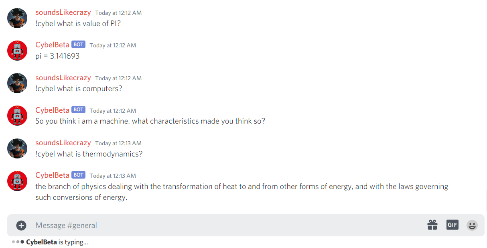

<p align="center">
  <a href="https://py-contributors.github.io/awesomeScripts/"></a>

  <h2 align="center">👉 Discord Bot implemented in Python 👈</h2>
</p>


- [Features](#features)
- [Bot Commands](#bot-commands)
  - [Stable Version Commands](#stable-version-commands)
    - [**Admin Commands**](#admin-commands)
    - [**User Commands**](#user-commands)
  - [Beta Version Commands](#beta-version-commands)
- [Upcoming Feature](#upcoming-feature)
- [Support Here](#support-here)
- [License](#license)
- [Author](#author)

## Features

- Admin Commands for server management with powerful moderation
- Stay connected every time with 99% uptime
- Custom welcome message for each user when join
- Separate DM message upon joining server
- Utility async APIs
- Commands for user access
- AI enabled chatbot(only in Beta Version)
- Log Everything with embed message
- AutoMod - Delete offensive word automatically[optional]
- Use the bot to its full potential without ever annoying anyone
- More Features coming soon...

Invite **Cybel** into your server

- [Cybel Stable](https://discord.com/api/oauth2/authorize?client_id=832137823309004800&permissions=142337&scope=bot)
- [Cybel Beta](https://discord.com/api/oauth2/authorize?client_id=831918257166090250&permissions=142337&scope=bot)

## Bot Commands

### Stable Version Commands

> Admin Level commands will require the admin permission. Assign a Admin role to the Bot.

#### **Admin Commands**

| command name             |                  Use Of commands                  | Example                                |
| ------------------------ | :-----------------------------------------------: | :------------------------------------- |
| **kick**                 |           Kick user from Discord server           | `!kick <user_name> <reason>`           |
| **ban**                  |           Ban user from Discord server            | `!ban <user_name> <reason>`            |
| **unban**                |          Unban user from Discord server           | `!unban <member_id>`                   |
| **mute**                 |       mute the user in your discord server        | `!mute <user_name>`                    |
| **unmute**               |      Unmute the user in your discord server       | `!unmute <user_name>`                  |
| **chnick**               |            Change Nicknames of Members            | `!chnick <user_name> <Nick_name>`      |
| **create_role**          |            Create New Roles in server             | `!create_role <new_role>`              |
| **give_role**            |               Give role to members                | `!give_role <user_name> <role_name>`   |
| **create_category**      |   Command for create category in Guild/Channel    | `!create_category <category_name>`     |
| **create_text_channel**  | command for create text channel in Guild/Channel  | `!create_text_channel <Channel_name>`  |
| **create_voice_channel** | command for create voice channel in Guild/Channel | `!create_voice_channel <channel_name>` |
| **delete_category**      |      Command for delete category from server      | `!delete_category <category_name>`     |
| **delete_text_channel**  |          Command for delete text channel          | `!delete_text_channel <channel_name>`  |
| **delete_voice_channel** |          Command for delete voice channe          | `!delete_voice_channel <channel_name>` |

check !help <command_name> for command description

#### **User Commands**

> User Level commands.

| command name      |               Use Of commands               | Example              |
| :---------------- | :-----------------------------------------: | :------------------- |
| **help**          |        Get the list of all commands         | !help                |
| **info**          |    Tells you some info about the member.    | !info <member_name>  |
| **fact**          |        function to send random fact         | !fact                |
| **joke**          |        function to send random joke         | !joke                |
| **ping**          |  Ping-Pong function to test the bot status  | !ping                |
| **cat**           |         Get Random picture of Cats          | !cat                 |
| **dog**           |         Get Random picture of Dogs          | !dog                 |
| **fox**           |          Get Random picture of Fox          | !fox                 |
| **dice**          |          Roll a dice in ndn format          | !diceku 5d6          |
| **flipcoin**      |           Flip the coin randomly            | !flipcoin            |
| **create_invite** |            Create instant invite            | !create_invite       |
| **gh**            |            get Github user data             | !gh <user_name>      |
| **ifsc**          | Get Indian bank branch details by IFSC code | !ifsc <ifsc_code>    |
| **weather**       |          Get Weather of your City           | !weather <city_name> |
| **server**        |     to get the information about server     | !server              |


### Beta Version Commands

> Including above

| command name |  Use Of commands   | Example                       |
| ------------ | :----------------: | :---------------------------- |
| **cybel**    | AI Enabled ChatBot | !cyble What is thermodynamics |
| **c**        | aliases of !cybel  | !c What is thermodynamics     |



**Note**:- Cybel Beta may have some bugs, broken features and experimental commands.

for more details check `!help <command_name>` in server.

## Upcoming Feature

- AI Enabled ChatBot(In Beta Version)
- Curse word deletion
- Role Upgrade
- Reactions Roles
- ~~Create Instant Invite~~
- ~~Kick/Ban User~~
- more...

## Support Here

<a href="https://www.buymeacoffee.com/codeperfectplus"></a>

## License

```txt
THE SOFTWARE IS PROVIDED "AS IS", WITHOUT WARRANTY OF ANY KIND, EXPRESS OR
IMPLIED, INCLUDING BUT NOT LIMITED TO THE WARRANTIES OF MERCHANTABILITY,
FITNESS FOR A PARTICULAR PURPOSE AND NONINFRINGEMENT. IN NO EVENT SHALL THE
AUTHORS OR COPYRIGHT HOLDERS BE LIABLE FOR ANY CLAIM, DAMAGES OR OTHER
LIABILITY, WHETHER IN AN ACTION OF CONTRACT, TORT OR OTHERWISE, ARISING FROM,
OUT OF OR IN CONNECTION WITH THE SOFTWARE OR THE USE OR OTHER DEALINGS IN THE
SOFTWARE.
```

check more at [MIT License](/LICENSE)

## Author

- Project: Cybel[Discord Bot]
- Author: CodePerfectPlus
- Language: Python
- Github: [GitHub](https://github.com/codePerfectPlus)
- Website: [CodePerfectPlus](http://codeperfectplus.herokuapp.com/)
- Email: [Email Me](mailto:codeperfectplus@gmail.com)